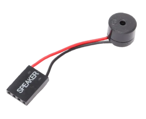
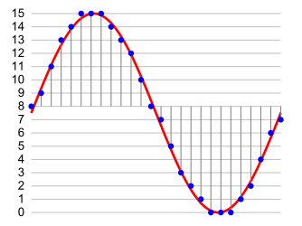
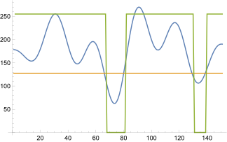
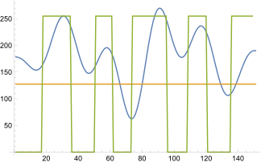
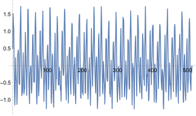
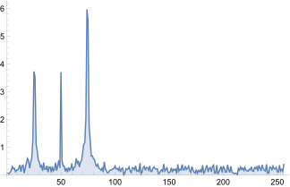
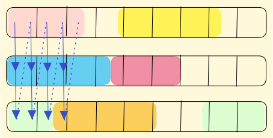

# 🎵 BeeSynth Project
## The frequency-perfect synthesizer for a PC speaker
### ✔️ Features
* Written in [Rust](https://www.rust-lang.org/) 🦀
* Support playing MP3, WAV, FLAC, tracker music and more on a PC speaker.
* Digital sound processing: pass filters, notes extraction and more.
* Support for chaining filters in a pipeline.
* Synthesizer with its own musical notation.
* Extremely low-latency audio output using IOPL.
* Batteries are included! 🔋

---

### ▶ Usage
> Requires Administrator rights in order to load a kernel driver.

There are a lot of options to fine tune your sound, but you can omit them all and just play your music:
```cmd
beesynth.exe music.mp3
```
For a detailed description of command line arguments, see here:
* 🌊 [BeeWave](./BEEWAVE.md) - player and DSP engine for different audio formats.
* 🎹 [BeeSynth](./BEESYNTH.md) - synthesizer which allows you to write your own music using a musical notation.   

---

### **∫**  How it works
Table of contents:
* [PC-speaker](#pc-speaker)
    - [Frequency generator](#frequency-generator)
    - [Direct membrane control](#direct-membrane-control)
* [Dealing with I/O ports from usermode](#deal-with-ports)
    - [Input-Output Privilege Level (IOPL)](#iopl)
    - [Input-Output Permission Bitmap (IOPB)](#iopb)
    - [Patch EFLAGS.IOPL in the KTRAP_FRAME](#patch-iopl)
* [Sound theory](#sound-theory)
    - [Pulse-Code Modulation (PCM)](#pcm)
    - [Fourier expansion](#fourier-expansion)
    - [Multichannel approach](#multichannel-approach)
* [Time management](#time-management)
    - [Measure CPU frequency](#cpu-freq)
    - [Nano-sleep](#nano-sleep)


---

### <a id="pc-speaker"></a> ♫ PC-speaker

Almost everyone desktop computers have a PC speaker. It's a small piezoelectric buzzer that you hear every time your PC turns on, that signals that [Power-On Self Test](https://en.wikipedia.org/wiki/Power-on_self-test) is completed.  

<p align="center"></p>

It is controlled via [I/O ports](https://wiki.osdev.org/I/O_Ports), and its membrane can have only two positions: raised when the voltage is applied to the membrane, and lowered when the voltage is removed. Using I/O ports we can control the position of the membrane and thus generate sound.

Schematically it looks like this:

<p style="text-align: center;"></p>

I/O ports are the way the CPU communicates with peripherals and the chipset using two privilege instructions: `in` and `out`. You can find description for all I/O ports in specification for your chipset:
* **Intel Chipset Family Platform Control Hub Datasheet** (for 700 Series PCH: [Vol.1](https://www.intel.com/content/www/us/en/content-details/743835/intel-700-series-chipset-family-platform-controller-hub-datasheet-volume-1-of-2.html) and [Vol.2](https://www.intel.com/content/www/us/en/content-details/743845/intel-700-series-chipset-family-platform-controller-hub-datasheet-volume-2-of-2.html)).
* **AMD Processor Programming Reference** ([PPR](https://www.amd.com/en/support/tech-docs)).

There are two ways to control a PC speaker: use a frequency generator and send its output to the input of the speaker or set the position of the membrane manually. Let's consider them all.

---

### <a id="frequency-generator"></a> **∿** Frequency generator
The first way is to use [Programmable Interrupt Timer (PIT)](https://wiki.osdev.org/Programmable_Interval_Timer) that can generate a square wave with a fixed frequency of 1'193'182 Hz. We can get a desired frequency by setting up a 16-bit divisor in the range from 1 to 65535 that gives us frequencies from 1.193182 MHz to 19 Hz accordingly.  
We can deduce the min and max frequencies and the relationship between the divisor and the desired frequency:  
_**Fbase**_ = 1.193182 MHz - is the fixed frequency of the PIT.  
_**Divisor**_ ∈ [1..65535], excluding zero because you can't divide by zero.  
_**Fdesired**_ = _**Fbase**_ / _**Divisor**_  
_**Fmin**_ = 1.193182 MHz / 65535 ≈ 18.206 Hz, after rounding up we get 19 Hz.  
_**Fmax**_ = 1.193182 MHz / 1 = 1193182 Hz  

First of all we need to prepare the PIT to generate square waves using its control port 0x43. Let's see its layout:  
```
Bits        Usage
6 and 7     Select channel:
                0 0 = Channel 0
                0 1 = Channel 1
                1 0 = Channel 2
                1 1 = Read-back command (8254 only)
4 and 5     Access mode:
                0 0 = Latch count value command
                0 1 = Access mode: lobyte only
                1 0 = Access mode: hibyte only
                1 1 = Access mode: lobyte/hibyte
1 to 3      Operating mode:
                0 0 0 = Mode 0 (interrupt on terminal count)
                0 0 1 = Mode 1 (hardware re-triggerable one-shot)
                0 1 0 = Mode 2 (rate generator)
                0 1 1 = Mode 3 (square wave generator)
                1 0 0 = Mode 4 (software triggered strobe)
                1 0 1 = Mode 5 (hardware triggered strobe)
                1 1 0 = Mode 2 (rate generator, same as 010b)
                1 1 1 = Mode 3 (square wave generator, same as 011b)
0           BCD/Binary mode: 0 = 16-bit binary, 1 = four-digit BCD
```
The only channel that connected to the PC speaker is the Channel 2.  
We need to select the Channel 2, set the Access mode to lobyte/hibyte to work with 16-bit divisor and set the Operating mode to square wave generator.  
So, we need to write `0xB6` or `0b10_11_111_0` to the control port `0x43`:
```asm
;  10_11_111_0 = 0xB6
;  ^  ^  ^   ^
;  |  |  |   Use 16-bit binary for a divisor
;  |  |  Square wave generator
;  |  Access mode: the low byte is the first, the high byte is the second
;  Channel 2

mov al, 0xB6
out 0x43, al
```
Now we need to write the divisor to the Channel 2 data port `0x42` in two steps: the low part and the high part:
```asm
divisor dw 0BBAAh  ; 16-bit divisor

mov ax, divisor    ; al = divisor.low, ah = divisor.high
out 0x42, al       ; port[0x42] = low
shr ax, 8          ; al = ah
out 0x42, al       ; port[0x42] = high

; This gives us the desired frequency of 24 Hz:
; 1'193'182 Hz / 0xBBAA = 24 Hz
```
And finally we have to turn on the speaker using the NMI Status and Control port `0x61` (**NMI_STS_CNT** in Intel terms or **NMI_STATUS** in AMD terms).  
```
Bits        Usage
7           SERR# NMI Source Status
6           IOCHK# NMI Source Status
5           SPKRCLK (The output of the Counter 2)
4           Reserved in Intel, REFCLK (The output of the Counter 1) in AMD
3           IOCHK# NMI Enable
2           SERR# NMI Enable
1           Speaker Data Enable:
                0 = SPKR output is 0 (voltage is disabled)
                1 = SPKR output is 1 (voltage is applied)
0           Timer Counter 2 Enable:
                0 = Counter 2 is disabled
                1 = Counter 2 is enabled
```
We interested in the bits 1 and 0. We need to set them to 1 to enable the PIT timer and apply voltage to the PC speaker:
```asm
; Enable the speaker by enabling the PIT timer
; and applying voltage to the PC speaker:
; port[0x61] |= 0b11

in al, 0x61   ; Read the current value
or al, 0b11   ; Set bits 1 and 0
out 0x61, al  ; Write the new value

; Mute the speaker by disabling the PIT timer
; and removing voltage the PC speaker:
; port[0x61] &= ~0b11

in al, 0x61       ; Read the current value
and al, 11111100b ; Reset bits 1 and 0
out 0x61, al      ; Write the new value
```
With this code, we turned on the frequency generator in PIT that was connected to the speaker input.

---

### <a id="direct-membrane-control"></a> ⇅ Direct membrane control
The second way is to control the position of the PC speaker's membrane directly by applying and removing voltage manually using the bit 1 (_Speaker Data Enable_) in the control port `0x61`:
```asm
; Raise the membrane:
; port[0x61] |= 0b10

in al, 0x61   ; Read the current value
or al, 0b10   ; Apply voltage
out 0x61, al  ; Write the new value

; Reset the membrane:
; port[0x61] &= ~0b10

in al, 0x61       ; Read the current value
and al, 11111101b ; Remove voltage
out 0x61, al      ; Write the new value
```
We don't need to enable and prepare the PIT timer in this case as we are acting like a frequency generator ourselves.

---

### <a id="deal-with-ports"></a> ⮂ Deal with ports from usermode
On the way to deal with the speaker, we encounter the following problem: the `in` and `out` instructions are privileged and can only be executed in the kernel mode. The first obvious solution is to use a kernel driver that will work with I/O ports and call it from our application. But it brings unwanted delays caused by creating and dispatching [IOCTL](https://learn.microsoft.com/en-us/windows/win32/devio/device-input-and-output-control-ioctl-) and [IRP](https://learn.microsoft.com/en-us/windows-hardware/drivers/gettingstarted/i-o-request-packets) requests and switching from Ring3 to Ring0 and back.

But there are two ways to allow access to I/O ports from usermode:
* **<a id="iopl"></a>** The first one is to use the [I/O Privilege Level (IOPL)](https://en.wikipedia.org/wiki/IOPL) flag in the [EFLAGS](https://en.wikipedia.org/wiki/FLAGS_register_(computing)) register. It can take values from 0 to 3 and controls the current privilege level ([CPL](https://en.wikipedia.org/wiki/Protection_ring#Privilege_level) that is already known as Ring) from which the CPU can access the `in`, `out`, `cli` and `sti` instructions. Normally the `EFLAGS.IOPL` is set to 0, which means that access to these instructions is granted only from Ring0, but if we set it to 3, we will be able to execute them from usermode. Changing the `EFLAGS.IOPL` is only available from kernel mode. In Linux we have the specified system call [`iopl()`](https://man7.org/linux/man-pages/man2/iopl.2.html) that allows us to change the IOPL flag, but in Windows there are no ways to do this without a kernel driver: you can't set IOPL field using the [`SetThreadContext`](https://learn.microsoft.com/en-us/windows/win32/api/processthreadsapi/nf-processthreadsapi-setthreadcontext) as the kernel forcibly resets it to zero.
* **<a id="iopb"></a>** The second one is to use [I/O Permission Bitmap (IOPB)](https://en.wikipedia.org/wiki/Task_state_segment#I/O_port_permissions). It is a bitmap in the [Task State Segment (TSS)](https://en.wikipedia.org/wiki/Task_state_segment) that controls access to each port separately. Each bit in the bitmap corresponds to a specific I/O port. If the bit is set to 0, access to the port is granted, and if it is set to 1, access is denied. 32-bit Windows has three undocumented kernel functions to modify the bitmap: [`Ke386SetIoAccessMap()`](https://github.com/HighSchoolSoftwareClub/Windows-Research-Kernel-WRK-/blob/master/WRK-v1.2/base/ntos/ke/i386/iopm.c#L76), [`Ke386QueryIoAccessMap()`](https://github.com/HighSchoolSoftwareClub/Windows-Research-Kernel-WRK-/blob/master/WRK-v1.2/base/ntos/ke/i386/iopm.c#L192) and [`Ke386IoSetAccessProcess()`](https://github.com/HighSchoolSoftwareClub/Windows-Research-Kernel-WRK-/blob/master/WRK-v1.2/base/ntos/ke/i386/iopm.c#L276). You can read more about them here: https://github.com/eantcal/ioperm. These functions are absent in 64-bit Windows, but you can find and modify the 64-bit TSS manually as it also contains an IOPB.

<a id="patch-iopl"></a>

As we want to deal with I/O ports in modern 64-bit Windows, we will use the first way. First of all, we need to determine what exactly and where we have to patch. Let's consider how a thread walks between privilege levels:
```
... Any user code ...
kernel32!CreateFile()
    ntdll!NtCreateFile()
        syscall(N)          Ring 3
----------------------------------
        KiSystemCall64()    Ring 0
            [ Save the usermode context to the KTRAP_FRAME structure ]
            [ Dispatch through the KiServiceTable ]
                ntoskrnl!NtCreateFile()
            [ Restore the usermode context from the KTRAP_FRAME ]
            KiKernelSysretExit()     ; Return to the Ring3

```
We see that the kernel saves the usermode context to the [KTRAP_FRAME](https://www.geoffchappell.com/studies/windows/km/ntoskrnl/inc/ntos/amd64_x/ktrap_frame.htm) structure before calling the syscall handler and restores it before returning to the usermode. This structure resides on the bottom of the kernel stack. You can find the beginning of the kernel stack for the current thread using the [`IoGetInitialStack()`](https://learn.microsoft.com/en-us/windows-hardware/drivers/ddi/wdm/nf-wdm-iogetinitialstack) function. So, to find the KTRAP_FRAME structure, we need to subtract the size of the structure from the stack pointer as a stack grows from the upper addresses to lower. At this point we can modify any register in the user context and it will be applied at the restoration point. Let's patch the `EFLAGS.IOPL` flag:
```cpp
#include <ntddk.h>

auto* stack = static_cast<unsigned char*>(IoGetInitialStack());
auto* frame = reinterpret_cast<KTRAP_FRAME*>(stack - sizeof(KTRAP_FRAME));
frame->EFlags |= 0x3000; // Raise IOPL to Ring3
```
After that let's go to usermode and check whether it works:
```cpp
#include <intrin.h>

// Your usermode app:
int main()
{
    //
    // Call your driver to perform patching
    // for this thread as was stated above.
    //
    DeviceIoControl(...);

    // Let's check:
    _disable(); // cli
    _enable();  // sti

    return 0;
}
```
But there is the second challenge: to install a driver, you either need a [EV certificate](https://www.globalsign.com/en/code-signing-certificate/ev-code-signing-certificates) or you need to disable digital signature verification using these commands:
```
#
# Requires Administrator rights and reboot.
#

# Allow installing of unsigned drivers:
bcdedit.exe /set loadoptions DISABLE_INTEGRITY_CHECKS
bcdedit.exe /set TESTSIGNING ON

# Deny installing of unsigned drivers:
bcdedit.exe /set loadoptions ENABLE_INTEGRITY_CHECKS
bcdedit.exe /set TESTSIGNING OFF
```
Let's consider a way to patch the `EFLAGS.IOPL` using already signed drivers. These may be vulnerable drivers or drivers that provide functions for editing or mapping kernel or physical memory. One of these is the [InpOut](https://www.highrez.co.uk/downloads/inpout32/): it is signed, it's not banned by Microsoft, it works with SecureBoot enabled and it is able to map physical memory using [`ZwMapViewOfSection()`](https://learn.microsoft.com/en-us/windows-hardware/drivers/ddi/wdm/nf-wdm-zwmapviewofsection) for the `\Device\PhysicalMemory` object. We should map all physical memory into the userspace and find the `KTRAP_FRAME` there.

The scheme will be as follows:
1. Put the desired thread into the kernel and suspend in there. It gives us unlimited time to find its `KTRAP_FRAME` in the physical memory.
2. Make "anchors" in the context of our suspended thread so we know what to look for. It can be achived using the [`SetThreadContext()`](https://learn.microsoft.com/en-us/windows/win32/api/processthreadsapi/nf-processthreadsapi-setthreadcontext) function. We can assign the values of some registers to known magic values, which we will look for later.
3. Enumerate all physical RAM regions and map them into the usermode address space of our process. The RAM physical address space is not continuous: it is interspersed with areas reserved for I/O space for devices, so access to these regions can cause [unforeseen consequences](https://www.youtube.com/watch?v=RJN19V9-8hs). Physical memory ranges can be found in the registry key `HKEY_LOCAL_MACHINE\HARDWARE\RESOURCEMAP\System Resources\Physical Memory\.Translated`, which consists of [`CM_RESOURCE_LIST`](https://learn.microsoft.com/en-us/windows-hardware/drivers/ddi/wdm/ns-wdm-_cm_resource_list) structures.
4. Map each physical region into a userspace and find the `KTRAP_FRAME` structure in it using anchors (magic values) from the second step.
5. One we found the `KTRAP_FRAME` structure, we can patch it as described above, unmap the region and resume the thread.
```cpp
//
// Pseudocode, error checking is omitted for the simplicity.
//

struct PhysRegion
{
    uint64_t base;
    uint64_t size;
};

std::list<PhysRegion> getPhysRanges()
{
    // Parse HKEY_LOCAL_MACHINE\HARDWARE\RESOURCEMAP\System Resources\Physical Memory\.Translated
    return ...;
}

struct Mapping
{
    void* base;
    size_t size;
};

Mapping mapPhysRegion(const PhysRegion& physRegion)
{
    // Map the region using any driver that supports it.
    return ...;
}

void unmapPhysRegion(const Mapping& mapping)
{
    // Unmap the region.
}

//
// The given thread must be in the kernel
// until this function has finished.
//
bool patchIopl(HANDLE hThread)
{
    CONTEXT context{};
    context.ContextFlags = CONTEXT_ALL;
    GetThreadContext(hThread, &context);

    // Save the original context:
    const CONTEXT originalContext = context;

    // Just magic values which we will look for:
    context.Rax = 0x1ee7c0de;
    context.Rbx = 0xc0ffee;
    context.Rcx = 0x7ea;
    context.Rdx = 0xcaca0;

    // Set our magic anchors:
    SetThreadContext(hThread, &context);

    // Destroy tails of magic values in the stack:
    context = {};

    bool isKtrapFrameFound = false;

    const auto physRanges = getPhysRanges();
    for (const auto& physRange : physRanges)
    {
        const auto mapped = mapPhysRegion(physRange);
        for (uint64_t* value = static_cast<uint64_t*>(mapped.base) + sizeof(KTRAP_FRAME) / sizeof(uint64_t);
            value < static_cast<uint64_t*>(mapped.base) + mapped.size / sizeof(uint64_t);
            ++value)
        {
            if (*value == 0x1ee7c0de)
            {
                // It's not an anchor:
                continue;
            }

            KTRAP_FRAME* const candidate = CONTAINING_RECORD(value, KTRAP_FRAME, Rax);
            if (candidate->Rbx != 0xc0ffee
                || candidate->Rcx != 0x7ea
                || candidate->Rdx != 0xcaca0)
            {
                // It's not an anchor:
                continue;
            }

            // We found the KTRAP_FRAME:
            SetThreadContext(hThread, &originalContext); // Restore the original context
            candidate->EFlags |= 0x3000; // Raise IOPL to Ring3
            isKtrapFrameFound = true;
            break;
        }
        unmapPhysRegion(mapped);

        if (isKtrapFrameFound)
        {
            break;
        }
    }

    if (!isKtrapFrameFound)
    {
        SetThreadContext(hThread, &originalContext); // Restore the original context
    }

    return isKtrapFrameFound;
}

// Patch IOPL of the current thread:
bool patchSelfIopl()
{
    struct ThreadInfo
    {
        HANDLE hThread;
        HANDLE hThreadArrivedToKernelEvent;
        HANDLE hPatchFinishedEvent;
        bool ioplWasPatched;
    };

    ThreadInfo threadInfo{};
    threadInfo.hThread = OpenThread(THREAD_ALL_ACCESS, FALSE, GetCurrentThreadId());
    threadInfo.hThreadArrivedToKernelEvent = CreateEvent(nullptr, FALSE, FALSE, nullptr);
    threadInfo.hPatchFinishedEvent = CreateEvent(nullptr, FALSE, FALSE, nullptr);

    // Create the supplementor thread that will patch our thread as
    // the target thread must be in kernel all the time.
    HANDLE hPatcherThread = CreateThread(nullptr, 0, [](void* arg) -> DWORD
    {
        auto* const info = static_cast<ThreadInfo*>(arg);

        // Wait until the target thread entered the kernel:
        WaitForSingleObject(info->hThreadArrivedToKernelEvent, INFINITE);

        // Patch its IOPL:
        info->ioplWasPatched = patchIopl(info->hThread);

        // Return the target thread to usermode:
        SetEvent(info->hPatchFinishedEvent);

        return 0;
    }, &threadInfo, 0, nullptr);

    //
    // Atomically signal that our thread was entered into the kernel
    // and wait without exiting to usermode.
    //
    SignalObjectAndWait(
        info->hThreadArrivedToKernelEvent,
        info->hPatchFinishedEvent,
        INFINITE,
        FALSE
    );

    WaitForSingleObject(hPatcherThread, INFINITE);

    CloseHandle(hPatcherThread);
    CloseHandle(threadInfo.hThread);
    CloseHandle(threadInfo.hThreadArrivedToKernelEvent);
    CloseHandle(threadInfo.hPatchFinishedEvent);

    return threadInfo.ioplWasPatched;
}

int main()
{
    // Patch IOPL of the current thread:
    patchSelfIopl();

    // Now we can use the in/out/cli/sti instructions:
    _disable(); // cli
    _enable(); // sti

    return 0;
}
```

---

### <a id="sound-theory"></a>  $\int_{}^{}$ Sound theory
Well, now we have a way to control a PC speaker from an application. Now we need _what_ to play.

<a id="pcm"></a>

The most convenient format is [WAV](https://en.wikipedia.org/wiki/WAV). You can find specification on a format [here](http://soundfile.sapp.org/doc/WaveFormat/) or [here](https://www.mmsp.ece.mcgill.ca/Documents/AudioFormats/WAVE/WAVE.html). It contains an array of samples encoded with [Pulse-Code Modulation (PCM)](https://en.wikipedia.org/wiki/Pulse-code_modulation). In other words, each sample represents an amplitude of the speaker in a particular moment of time.
<p align="center"></p>

Howerer, this format is only applicable to the real speaker whose diaphragm position can be controlled flexibly by changing the voltage amplitude. But the PC speaker is a simple piezoelectric buzzer which can only be turned on and off: there are no intermediate states. So, we need to convert the PCM amplitudes into a sequence of on/off samples.

The first obvious way is to compare a sample with zero. If the sample is greater than zero - treat it as a speaker's up position, if the sample is lower than zero - treat as down.

It will look like this: the blue line is an original PCM signal, the green line is a signal that we will send to the speaker.
<p align="center"></p>
We can see how much information we loss in this approach.

But we can do smarter. We can switch the speaker's state if the current amplitude differs from the amplitude in the past switching by more than a given percentage. It will look like this:
<p align="center"></p>
We see that this approach brings a lot more information than a previous way, so the sound will have a better quality.

<a id="fourier-expansion"></a>

But there is another way to play sound. As we know, each finite periodic function can be represented as a sum of harmonics - sine waves with different frequencies and amplitudes. This representation is called [Fourier series expansion](https://en.wikipedia.org/wiki/Fourier_series):  
$$\hat{f}(\omega)=\frac{1}{\sqrt{2\pi}}\int_{-\infty}^{\infty} f(x)e^{-ix\omega}\, dx$$

Where:  
$f(x)$ is an infinite periodic function which we want to expand.  
$\omega$ is a frequency of a harmonic.  
$\hat{f}(\omega)$ is a complex amplitude of a harmonic with a frequency $\omega$.  

Expanding the function into a Fourier series, we can get a set of harmonics (frequencies) with their amplitudes that make up the signal at any given time. This expansion is called spectrum.

We also remember that the PC speaker has a regime in which we can set the sound frequency using the PIT timer. So, we can get the dominant frequencies at any given time in our signal and play them back on the speaker.

As the wave is not infinite function that is requried by analitical solution, we can use [discrete Fourier transform](https://en.wikipedia.org/wiki/Discrete_Fourier_transform) in which the integral is replaced by a finite sum:  
$$X_k = \sum_{n=0}^{N-1} x_n e^{\frac{-i 2 \pi}{N} k n}=\sum_{n=0}^{N-1} x_n [\cos(2 \pi k n / N) - i \sin(2 \pi k n / N)], \space\space\space\space k = 0, \ldots, N-1.$$

Where:  
$N$ - number of samples.  
$x_n$ - value of the signal at time $n$  
$X_k$ - value of the Fourier transform at frequency $k$.  

The second part follows from the [Euler's formula](https://en.wikipedia.org/wiki/Euler%2527s_formula):  
$$e^{ix} = \cos(x) + i \sin(x)$$

In order to apply this to our wave file we need to create a sampling window with a given size $N$ and apply the discrete Fourier transform to it. In result we will get an array with size $N$ where each element is a complex amplitude of the frequency according to the position of the element. The frequency of the entry is calculated as follows:  
$$f_k = \frac{k}{N} \cdot f_s$$

Where:  
$f_k$ - frequency of the element.  
$k$ - position of the element, $ k = 0,...,N-1 $.  
$N$ - size of the sampling window (e.g. 4096).  
$f_s$ - sampling frequency (e.g. 44100 Hz for a typical WAV file).  

Programmatically, we can calculate the discrete Fourier transform using the [Fast Fourier Transform (FFT)](https://en.wikipedia.org/wiki/Fast_Fourier_transform) algorithm.

As a result, we will get an array of complex amplitudes that have contributon to the audio signal in the selected sampling window. Complex numbers have two parts: real and imaginary. The real part of the frequency is the amplitude of the sine part, and the imaginary part is the amplitude of the cosine part. Using the [complex plane](https://en.wikipedia.org/wiki/Complex_plane) and the [Pythagorean theorem](https://en.wikipedia.org/wiki/Pythagorean_theorem), we can calculate the modulus of a complex number:
<p align="center"></p>

$$|z| = \sqrt{Re(z)^2 + Im(z)^2}$$

Finally, to convert the modulus of a complex amplitude into a habitual [decibels](https://en.wikipedia.org/wiki/Decibel), we can use the following formula:  
$$dB = 20 \cdot \log_{10}(|z|)$$

We can demonstrate this.  
Let's generate a periodic signal in [Wolfram Mathematica](https://www.wolfram.com/mathematica/):
```mathematica
signal[x_] := 0.8 Sin[0.9 x] + 0.3 Sin[0.6 x ] + 0.5 Cos[0.3 x] + 0.3 Sin[x^2];
wave = Table[signal[x], {x, 0, 512, 1}];
ListPlot[{wave}, Joined -> True, PlotStyle -> Line, PlotRange -> All]
```
<p align="center"></p>

And perform expansion into a Fourier series, which will give us the spectrum:
```mathematica
fourier = Fourier[wave];
fourier = Take[fourier, {1, Floor[Length[fourier] / 2], 1}];
ListPlot[Sqrt[(Re[fourier])^2 + (Im[fourier])^2], Joined -> True, PlotStyle -> Line, PlotRange -> All, Filling -> Axis]
```
<p align="center"></p>
These peaks are the dominant frequencies in the sampling window. Knowing this, we can set the PIT timer to the frequency of the highest peak and play it on the speaker: it will be a mono sound.

<a id="multichannel-approach"></a>

At the same time we can extract some of the most valueable frequencies and put them into several channels. We can switch them quickly one by one, like this:
<p align="center"></p>

This approach gives us a way to emulate polyphonic sound.

---

### <a id="time-management"></a> ⏱️ Time management
When playing a sound, we need to make delays between switching the state of the speaker. Let's calculate the minimum precision required for switching between samples in a typical WAV file with the discretization frequency of 44100 Hz:
$$ \frac{1}{44100} \approx 22.6 \space \mu s $$

So, to implement fast and precision delays we need more than [`Sleep()`](https://learn.microsoft.com/en-us/windows/win32/api/synchapi/nf-synchapi-sleep) that has a precision of 1 ms. If we go deeper, we can use `NtDelayExecution()` from `ntdll.dll` which has the following prototype:
```cpp
NTSYSAPI NTSTATUS NTAPI NtDelayExecution(IN BOOLEAN Alertable, IN PLARGE_INTEGER Interval);
```
It has a precision of 100 ns, which is more than enough for us. But with such low delays, the overhead of calling functions becomes extremely high. Switching to and from the kernel, potential thread switching by the scheduler, complicated wait logic in the kernel - all of these introduce huge errors in wait time and in themselves have a large and unpredictable execution time.

We need a low-latency way to wait for a given time with a very high resolution without jumping to the kernel with a predictable execution time. And such way is to use the [CPU timestamp counter (TSC)](https://en.wikipedia.org/wiki/Time_Stamp_Counter). It's a 64-bit CPU register that counts the number of cycles since the last reset. It is incremented on each clock cycle and is not affected by frequency scaling on modern CPUs.

<a id="cpu-freq"></a>

Knowing the CPU frequency we can calculate the required number of cycles to wait for a given time. In Intel, we can obtain the CPU base frequency using the [CPUID](https://en.wikipedia.org/wiki/CPUID) instruction with the _Processor Frequency Information_ leaf:
```cpp
#include <intrin.h>

using Hertz = unsigned long long;

Hertz getIntelBaseCpuFrequency() noexcept
{
    constexpr auto k_processorFrequencyInformation = 0x16;

    union ProcessorFrequencyInformation
    {
        int raw[4]; // [eax][ebx][ecx][edx]
        struct
        {
            int eax;
            int ebx;
            int ecx;
            int edx;
        } layout;
        struct
        {
            // Base frequency:
            unsigned short base;    // EAX:[15..0], in MHz
            unsigned short eaxHigh; // EAX:[31..16], reserved

            // Maximum frequency:
            unsigned short maximum; // EBX:[15..0], in MHz
            unsigned short ebxHigh; // EBX:[31..16], reserved

            // Bus frequency:
            unsigned short bus;     // ECX:[15..0], in MHz
            unsigned short ecxHigh; // ECX:[31..16], reserved

            unsigned int edx;       // EDX, reserved
        } freq;
    };

    ProcessorFrequencyInformation freqInfo{};
    __cpuid(&freqInfo.raw[0], k_processorFrequencyInformation);

    return static_cast<Hertz>(freqInfo.freq.base) * 1'000'000;
}
```
But there is no corresponding CPUD leaf in AMD, so we have to calculate the frequency ourselves. We can poll for some known time and meause ticks delta between the beginning and the end of the polling. Knowing the polling time and the number of ticks we can calculate the CPU frequency. We do not use [`Sleep()`](https://learn.microsoft.com/en-us/windows/win32/api/synchapi/nf-synchapi-sleep) which calls `NtDelayExecution()` internally as it performs syscall that impacts on measurements, but [`GetTickCount()`](https://learn.microsoft.com/en-us/windows/win32/api/sysinfoapi/nf-sysinfoapi-gettickcount) and [`GetTickCount64()`](https://learn.microsoft.com/en-us/windows/win32/api/sysinfoapi/nf-sysinfoapi-gettickcount64) read the current tick count directly from the kernel shared memory [`KUSER_SHARED_DATA`](https://learn.microsoft.com/en-us/windows-hardware/drivers/ddi/ntddk/ns-ntddk-kuser_shared_data):
```asm
; ULONGLONG __stdcall GetTickCount64Kernel32()
; {
;     return KUSER_SHARED_DATA->TickCountLow * KUSER_SHARED_DATA->TickCountMultiplier;
; }

GetTickCount64Kernel32 proc near
    mov     ecx, ds:7FFE0004h
    mov     eax, 7FFE0320h
    shl     rcx, 20h
    mov     rax, [rax]
    shl     rax, 8
    mul     rcx
    mov     rax, rdx
    retn
GetTickCount64Kernel32 endp
```
So, we can use the following code to measure the CPU frequency for AMD processors:
```cpp
#include <Windows.h>
#include <intrin.h>

using Hertz = unsigned long long;

Hertz getAmdBaseCpuFrequency() noexcept
{
    constexpr auto k_measurementCount = 5;
    constexpr auto k_msInSec = 1000;
    constexpr auto k_measuringIntervalMsec = 200;

    unsigned long long frequencyAccumulator = 0;

    //
    // Measure the CPU frequency k_measurementCount times to get the average.
    // You can calculate the median instead of the average for more accuracy.
    //
    for (auto i = 0; i < k_measurementCount; ++i)
    {
        const auto initialTickCount = GetTickCount64();
        const auto begin = __rdtsc();

        //
        // Poll for the given time.
        // Avoid use of _mm_pause() here as it introduces non-predictable delays.
        //
        while ((GetTickCount64() - initialTickCount) < k_measuringIntervalMsec)
        {
        }

        const auto end = __rdtsc();

        const auto elapsedCycles = end - begin;

        frequencyAccumulator += elapsedCycles * k_msInSec / k_measuringIntervalMsec;
    }

    return frequencyAccumulator / k_measurementCount;
}
```

<a id="nano-sleep"></a>

Now we can implement a function that waits for a given time using the TSC:
```cpp
#include <intrin.h>

//
// Use GetIntelBaseCpuFrequency() and GetAmdBaseCpuFrequency() from the above.
//

union MaximumFunctionNumberAndVendorId
{
    static constexpr auto k_leaf = 0;

    int raw[4]; // [eax][ebx][ecx][edx]

    struct
    {
        unsigned int LargestStandardFunctionNumber;
        unsigned int VendorPart1; // 'uneG' || 'htuA'
        unsigned int VendorPart3; // 'letn' || 'DMAc' --> 'GenuineIntel' or 'AuthenticAMD' (EAX + EDX + ECX)
        unsigned int VendorPart2; // 'Ieni' || 'itne'

        bool isIntel() const
        {
            // GenuineIntel:
            return (VendorPart1 == 'uneG')
                && (VendorPart2 == 'Ieni')
                && (VendorPart3 == 'letn');
        }

        bool isAmd() const
        {
            // AuthenticAMD:
            return (VendorPart1 == 'htuA')
                && (VendorPart2 == 'itne')
                && (VendorPart3 == 'DMAc');
        }
    } layout;
};

Hertz getCpuFrequency() noexcept
{
    MaximumFunctionNumberAndVendorId vendor{};
    __cpuid(&vendor.raw[0], MaximumFunctionNumberAndVendorId::k_leaf);

    if (vendor.layout.isIntel())
    {
        return getIntelBaseCpuFrequency();
    }
    
    return getAmdBaseCpuFrequency();
}

class NanoWait
{
private:
    Hertz m_frequency;

public:
    NanoWait() noexcept
        : m_frequency(getCpuFrequency())
    {
    }

    void nanoWait(uint64_t nsec) const noexcept
    {
        const auto cyclesToWait = nsec * m_frequency / 1'000'000'000;

        const auto begin = __rdtsc();

        while ((__rdtsc() - begin) < cyclesToWait)
        {
        }
    }
};
```
Using this waiter, we get the lowest possible latency and the highest possible accuracy with the resolution of ~15 nanoseconds that are required to call `rdtsc` itself.

### 🏁 Conclusion
We have collected all the necessary components to build our speaker synthesizer: we learned how to control the PC speaker from the usermode, figured out digital sound processing and wrote a high-performance timer. With this baggage, we are ready to sail on sound waves. In this project, you will find all the above techniques, which will give you an incredible experience when listening to music through a PC speaker.

Thank you for your attention and good luck!

<p align="center"></p>
